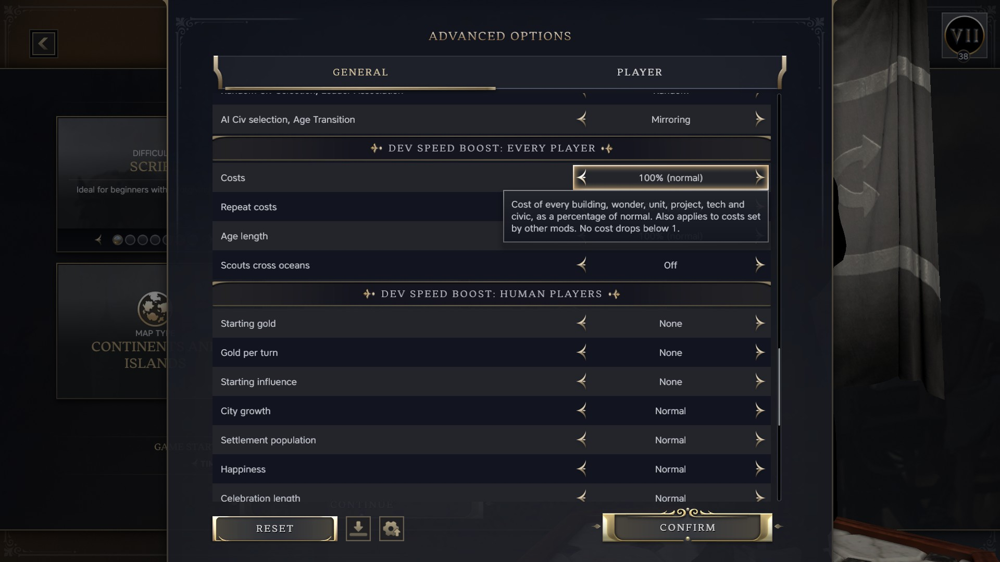
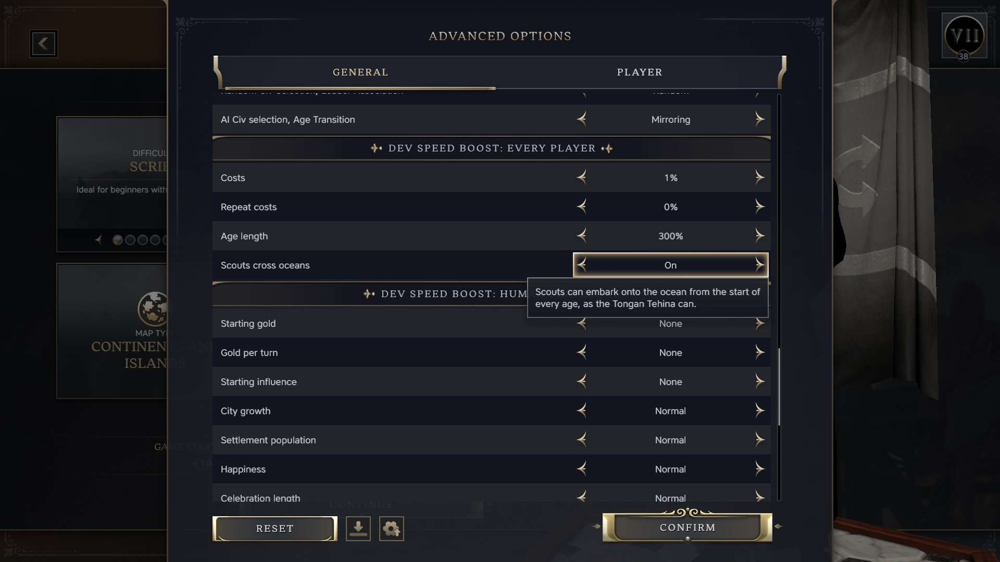

# Dev Speed Boost

A Civilization VII testing aid for mod development. It speeds a game up so
that checking a change takes minutes rather than an evening.

## How to use it

Install it once and leave it on. Every option defaults to off, so a normal
game is unaffected.

For a test game, open **Advanced Setup**. The options are in two sections.

**Dev Speed Boost: every player** changes rules the AI shares:

| Option | Choices |
|---|---|
| Costs | 100% (normal), 50%, 25%, 10%, 5%, 1% |
| Repeat costs | 100% (normal), 50%, 0% |
| Age length | 10% to 300% of normal |
| Scouts cross oceans | Off, On |

**Dev Speed Boost: human players** leaves the AI alone:

| Option | Choices |
|---|---|
| Starting gold | None to 1,000,000 |
| Gold per turn | None to +25,000 |
| Starting influence | None to 100,000 |
| City growth | Normal to +1000% Growth Rate |
| Settlement population | Normal to +10 when founded |
| Happiness | Normal to +100 per settlement per turn |
| Celebration length | -50% to +300% |
| Policy slots | Normal to +5 |
| Legacy points | None to +10 in each category |
| Unit movement | Normal to +10 |
| Unit sight | Normal to +5 |
| Ignore terrain | Off, Merchants and Settlers, All units |
| Merchant movement | Normal to +50, on top of unit movement |
| Settler movement | Normal to +20, on top of unit movement |
| Trade route range | Normal to +20, or unlimited |
| Trade routes | Normal to +10 |
| Combat strength | Normal to +50 |
| Commander experience | Normal to +1000% |
| Unit healing | Normal to +100 per turn |
| Reveal map | Off, On |
| Settlement cap | Normal to +100 |

Hover an option to see what it does.

The choices are fixed lists because the game can only switch mod content on
an exact setup value. It cannot read a typed number. To add an amount, see
"Changing the options" below.

Costs cover buildings, wonders, units, projects, techs and civics. Repeat
costs cover how much each copy adds to the next, such as the rising price of
Settlers. The cost cut loads late, so it also scales costs set by the mod you
are testing. Starting gold and influence are granted once, when the game
starts. A game started in the Modern age needs the larger amounts.

## Compatibility

- The options change rules and are fixed once the game starts.
- A save made with the mod enabled needs it enabled to load, even if every
  option was off. Disable the mod before starting a game to share.

## AI use

The code and docs for this mod were written with AI, using Claude Code. The
mod is tested by playing the game.

## Changing the options

The modinfo, the setup options and the data files are all generated from the
`OPTIONS` table in `tools/build.py`. To add an amount or an option, edit the
table and run:

    python3 tools/build.py

## Contributing

See [CONTRIBUTING.md](CONTRIBUTING.md).

## Licence

MIT. See [LICENSE](LICENSE).
